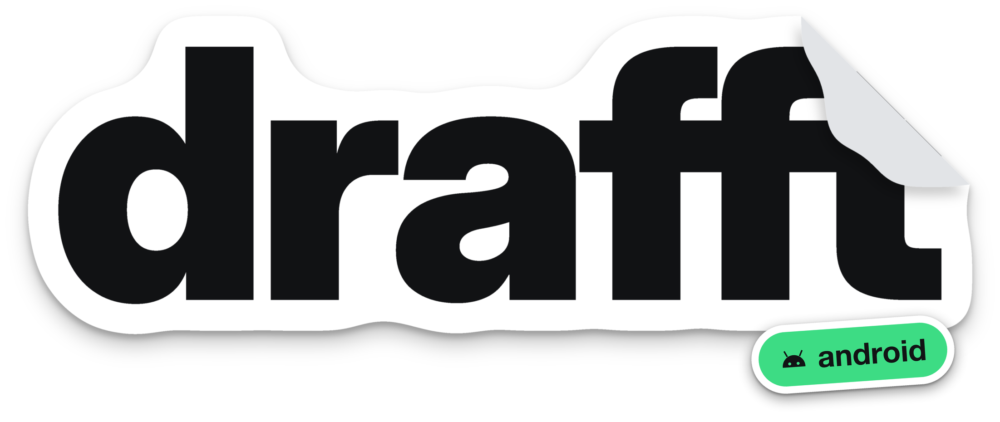

<p align="center">
  
</p>

# drafft for Android

The Android app of drafft, the dating app for people who train. It is a
port of the iPhone app (`sylwaninn/drafft`): same features, same behaviour, same wording, same look,
in Kotlin and Jetpack Compose. Conventions for contributors and agents: [AGENTS.md](AGENTS.md).

## Build

Requirements: Android Studio (AGP 8.13), JDK 17+, Android SDK 36.

```sh
./gradlew assembleProductionDebug      # production backend
./gradlew assembleStagingDebug         # "drafft β", staging backend
./gradlew assembleLocalDebug           # "drafft local", the local Supabase of drafft-backend
```

The three flavors mirror the iPhone schemes (`Drafft`, `Drafft Staging`, `Drafft Local`). They share
the application id `so.drafft.app`, so installing one replaces the other; the launcher name tells
them apart. Only public keys live in the build (Supabase publishable keys, RevenueCat and Turnstile
keys, the Sentry DSN, the PostHog project key).

### Environment values (`config/<flavor>.properties`, committed)

Like the iPhone's `Config/*.xcconfig`, each flavor has one file of public values, read into
`BuildConfig`:

| Key | What |
|---|---|
| `SUPABASE_URL`, `SUPABASE_PUBLISHABLE_KEY` | The Supabase project (publishable key only) |
| `REVENUECAT_API_KEY` | RevenueCat public SDK key for Google Play (`goog_...`) |
| `TURNSTILE_SITE_KEY` | Cloudflare Turnstile public site key |
| `SMS_CODE_LIFETIME` | Auth's SMS OTP expiry, in seconds |
| `APP_DISPLAY_NAME` | Launcher name |
| `SENTRY_DSN` | Sentry DSN, EU region (crashes, errors, performance). Empty: off |
| `POSTHOG_API_KEY`, `POSTHOG_HOST` | PostHog project key (`phc_...`) and EU host (product analytics). Empty: off |

Only public keys: the build refuses anything that looks like a secret, and a production or staging
URL that isn't https. A release build lacking a Supabase or RevenueCat value fails. The local flavor
is debug only.

The local Supabase's URL and key depend on the machine: `scripts/local-backend.sh` writes them from
drafft-backend's running Supabase to `local.private.properties` (gitignored, like the iPhone's
`Local.private.xcconfig`; `--device` for a phone on the same Wi-Fi). Without them the local app stops
at launch and says what's missing.

### Telemetry (Sentry, PostHog)

Crash reporting and product analytics, their privacy rules and the tracking plan:
[docs/telemetry.md](docs/telemetry.md). Release builds upload their R8 mapping to Sentry when
`SENTRY_AUTH_TOKEN`, `SENTRY_ORG` and `SENTRY_PROJECT` are set (CI secrets).

### Git hooks

Once per clone: `git config core.hooksPath .agents/git-hooks` (commit format, no push to `main` or `staging`; see
`.agents/rules/`).

### Push notifications (FCM)

Put each Firebase project's `google-services.json` in `app/src/<flavor>/`. Without it the app builds
and runs; push stays off. Server side, two things are needed:
- the backend's `register_push_token` and push sender must accept FCM tokens (the iPhone sends APNs);
- Stream needs a Firebase push provider named `drafft-fcm`.
- Setup state of Google Play, Firebase and RevenueCat: [docs/store-setup.md](docs/store-setup.md).

## Checks that run anywhere (no Android SDK)

```sh
gradle -p tools/jvmcheck compileKotlin -q   # type-checks all platform-neutral code on the JVM
gradle -p tools/jvmcheck test               # unit tests (model, cache, cards, chat payloads, sessions...)
python3 scripts/check-strings.py            # every L("...") key exists in the string catalog
python3 scripts/ci/design_lint.py           # DESIGN.md rules (same as the iPhone app's lint)
python3 scripts/ci/i18n_lint.py             # 7 languages, placeholders, brand, WORDING.md's banned words
```

`tools/jvmcheck` compiles `src/main/kotlin` of every module against Compose Multiplatform. Code that
needs the Android SDK lives in each module's `src/android/kotlin`; see AGENTS.md.

## Strings

All text comes from the iPhone app's catalog (`Localizable.xcstrings`), shared key for key, in the
seven languages. After a wording change on the iPhone side:

```sh
python3 scripts/sync-strings.py ../drafft-ios/Drafft/Resources/Localizable.xcstrings
```

The few sentences the iPhone writes about its own platform (App Store, Apple Account, iPhone Settings)
have an Android wording, in the 7 languages, under the same keys in
`core/model/src/main/resources/i18n/android/` (Google Play, Google account, the phone's settings).
`L` reads them first. When such a sentence changes on the iPhone side, update its Android variant too
(the test `LocalizationTest` checks every variant still matches a catalog key).

## Layout

```
core/model   data types and standalone logic (pure Kotlin)
core/data    AppModel, Supabase, Stream chat, RevenueCat, caches, platform services
core/ui      design system (DESIGN.md), sheets, blur, navigation, photos
app          screens (feature/<area>), RootView, MainTabs, MainActivity
tools/jvmcheck, scripts   checks and catalog sync
```
