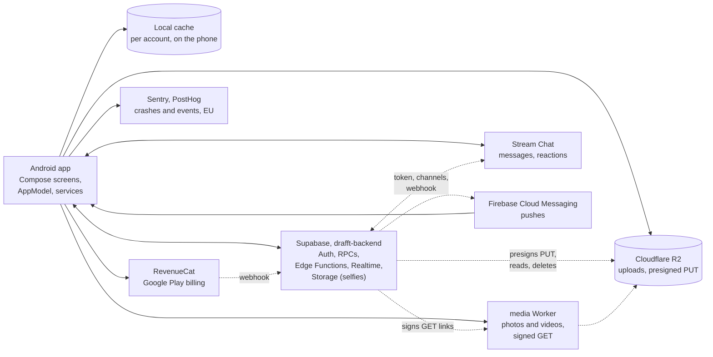

<div align="center">


**Meet someone who gets your rhythm.**

The Android app of drafft, the dating app for people who train.<br>
Profiles lead with how someone moves, and a match is an invitation to propose a session together.

[](https://github.com/sylwaninn/drafft-android/actions/workflows/app.yml)
[](https://github.com/sylwaninn/drafft-android/actions/workflows/pr.yml)


[Product](#product) | [How it works](#how-it-works) | [Getting started](#getting-started) | [Checks](#checks-and-release) | [Docs](#documentation)

</div>

## Product

drafft is the dating app for people who train. Sports come first on a profile, and when two people like each
other, drafft invites them to propose a session. A match promises nothing on its own: the proposal is the next
step, and the people decide.

| Area | What the app does |
|---|---|
| **Sign up** | Email and password, phone check by SMS code, consents recorded on the server |
| **Profile** | Photos, sports with how often, a voice intro, an icebreaker others can react to |
| **Discover** | Nearby profiles filtered by sport, likes, super likes, boosts |
| **Matches and sessions** | Mutual likes, session invites |
| **Chat** | Text, photos, videos, voice messages, replies and reactions |
| **drafft tempo** | The paid tier and packs, through Google Play billing |
| **Safety** | Report and block, moderation, selfie check, help center |

Users and principles: [PRODUCT.md](PRODUCT.md). Visual system: [DESIGN.md](DESIGN.md). Every word people read:
[WORDING.md](WORDING.md).

## How it works

A native Android app on the drafft backend. The server is the source of truth: the app shows what it last
knew at once, then reads the server again and listens to the account's Realtime channel, so every screen
stays live.



### The app

- **Modules.** `core:model` (pure Kotlin: data types, catalog, ThumbHash), `core:data` (AppModel, Supabase, Stream,
  RevenueCat, caches, telemetry), `core:ui` (design system, navigation, images), `app` (screens, root, activity).
  Each module keeps platform-neutral code in `src/main/kotlin`, which `tools/jvmcheck` compiles on a plain JVM
  (running the `core:model` and `core:data` tests), and Android SDK code in `src/android/kotlin`.
- **Start.** `DrafftApplication` starts Sentry first, then Koin, the language, PostHog and diagnostics.
  `MainActivity` is the only activity. `RootView` shows welcome, sign-up or the five tabs (Discover, Likes,
  Sessions, Chats, You); each tab is built once, ahead of time, under the splash (or under welcome and sign-up).
- **State.** `AppModel` is one Koin singleton whose properties are Compose state (`mutableStateOf`), changed on
  the main thread only. Navigation is drafft's own `NavStack`, where screens push others: the Sessions and
  Chats tabs, Edit profile, Extras and welcome.

### Backend link

- **Client.** supabase-kt for Auth, Realtime and Storage (the selfie upload); RPCs, table reads and Edge
  Functions go through Ktor (OkHttp) with the publishable key and the session's token, refreshed 30 s before it
  expires. The session is kept in
  the app's private storage; backups are off.
- **Errors.** The backend answers a stable code (`hint` for database functions, `code` for Edge Functions);
  `ServerMessage` turns it into words, never the raw reply. `moderated` makes the app read the account again,
  and the hold screen shows if a hold is found.
- **Edge Functions called.** `media-upload-url`, `stream-token`, `chat-media`, `phone-code`, `purchase-sync`,
  `delete-account`, `support` (Turnstile when signed out), `app-config`.

### Live updates

The app joins the private Realtime topic `user:<id>`. After a failed join it waits longer each time, up to a
minute; a channel that stays down is rebuilt.

| Event | What the app does |
|---|---|
| `like`, `match`, `match_ended` | reads likes or matches again, closes an ended match |
| `session` | updates the session and its chat card |
| `media` | applies a photo's moderation verdict |
| `wallet` | reads the balance again (boosts, super likes, drafft tempo), and Likes, which drafft tempo changes |
| `profile`, `moderation` | reads the account again; a hold covers the app |
| `session_revoked` | signs out if this device's session ended elsewhere |

On each join and each return to the foreground, it also reads the account, the wallet and sessions again,
re-checks photo verdicts, resumes any purchase still being credited, and reads Discover again when what it shows
has grown old.

### Media

- **Upload.** `media-upload-url` returns a ticket, then the file goes straight to Cloudflare R2 with a presigned
  PUT (two retries; a new ticket on 403). Photos and videos are compressed first.
- **Profile photos.** A picked photo is a draft (`add_profile_media`), checked by the backend; its verdict
  arrives as a `media` event. Save publishes the set (`save_profile_media`); unsaved drafts are deleted.
- **Display.** Cards carry signed links of about an hour, renewed through `media_urls`. Coil asks the media
  Worker for the width it draws (`&w=` among 160, 320, 640, 1080, 1440), shows the ThumbHash meanwhile, and keeps
  96 to 256 MB in memory and 300 MB on disk, keyed by photo and width, never by signature. Six downloads at
  once, two on a slow network. Videos play in Media3 (ExoPlayer).
- **Chat media.** Photos and videos sent in a chat are delivered first, then checked silently (`chat-media`).
- **Blurred likes.** Without drafft tempo, Likes shows a ThumbHash, then a blurred copy made by the server.

### Chat

Stream Chat's low-level client, every screen drafft's own, with Stream's offline store (flushed at sign-out).
`stream-token` gives the
token (asked again whenever Stream needs one). One `messaging` channel per match, named by the match id; the
list shows the person's channels that aren't frozen. Photos, videos and voice messages are attachments that
carry a media key, never a link. Session cards, super like notes and replies to an icebreaker or a photo come
from the backend as messages. Texts written offline wait for the connection.

### Push notifications

- **Tokens.** `DrafftMessagingService` receives the FCM token; the app registers it with the backend
  (`register_push_token`, platform `android`) and with Stream (push provider `drafft-fcm`).
- **Senders.** The backend pushes likes, matches, sessions and reminders, photo refusals, account notices and
  the weekly boost; Stream pushes chat messages. Five channels: matches, likes, messages, sessions, account.
- **Taps.** A tap opens the chat, Discover (a boost), Sessions or the refused photo. Notification settings (`notify_*`) are saved on
  the profile, which the backend reads before sending.

### Purchases

RevenueCat on Google Play, logged in with the Supabase user id. Offerings: the current one (`default`, drafft
tempo), `boosts`, `super_likes`; entitlement `drafft_tempo`. Once Google Play confirms, `purchase-sync` credits the purchase on the
server and returns the new balance; until it answers, the app retries with backoff and keeps the purchase
pending for the account. Nothing is credited on the phone.

### Location

Coarse permission only, required to use the app. A reading comes from the fused provider or the system
providers, whichever answers first, then is blurred to the centre of a cell of about 1 km before
`set_location` or `area_at`. Outside France or offline, the app names the area itself.

### Telemetry

- **Sentry** (EU only, enforced at build): crashes, native crashes, ANRs, unexpected errors and sampled traces.
  No screenshots, replay, personal data or IP.
- **PostHog** (EU only): the app's own events and screens, plus PostHog's app lifecycle events; no other
  autocapture, no replay. There is no consent switch yet, so events stay anonymous, under an install id.
- **PrivacyGuard** drops what people typed, sensitive answers, locations and other people's ids before anything
  leaves the phone. Events and rules: [docs/telemetry.md](docs/telemetry.md).

### On the phone

- **Cache.** One folder per account in the no-backup directory: profile, matches, likes (with drafft tempo),
  the Discover deck. Shown first, then replaced by the server's answer. Erased at sign-out and account deletion.
- **Selfie check**, only when moderation asks: CameraX with ML Kit face detection, the photo goes to the backend's
  `verification-selfies` storage, then `submit_selfie`.

### Built with

| Layer | Choice |
|---|---|
| UI | Jetpack Compose, Material 3, Android 10+ (API 29), target SDK 36 |
| Language, DI | Kotlin 2.2, coroutines, kotlinx.serialization; Koin |
| Backend | [supabase-kt](https://github.com/supabase-community/supabase-kt), Ktor on OkHttp |
| Chat | [Stream Chat](https://github.com/GetStream/stream-chat-android), low-level client |
| Purchases | [RevenueCat](https://github.com/RevenueCat/purchases-android) |
| Media | [Coil](https://github.com/coil-kt/coil), Media3, CameraX, ML Kit face detection |
| Push | Firebase Cloud Messaging |
| Telemetry | [Sentry](https://github.com/getsentry/sentry-java), [PostHog](https://github.com/PostHog/posthog-android) |

Versions are pinned in `gradle/libs.versions.toml`.

## Getting started

Needs Android Studio (AGP 8.13), JDK 17+ and Android SDK 36; for the local backend, Docker and the Supabase CLI.

```sh
git config core.hooksPath .agents/git-hooks
(cd ../drafft-backend && supabase start)       # local backend
scripts/local-backend.sh                       # --device for a phone on the same Wi-Fi
./gradlew assembleLocalDebug                   # "drafft local"
```

| Flavor | Backend | Launcher name |
|---|---|---|
| `local` (debug only) | Supabase of drafft-backend on your machine | drafft local |
| `staging` | Supabase branch `staging` | drafft β |
| `production` | production | drafft |

The flavors share the application id `so.drafft.app`: installing one replaces the other. Each reads its public
values from `config/<flavor>.properties`; push needs the Firebase project's `google-services.json`. Keys, build
checks and push setup: [docs/configuration.md](docs/configuration.md).

## Checks and release

These run anywhere, no Android SDK needed:

```sh
gradle -p tools/jvmcheck compileKotlin -q      # type-check platform-neutral code
gradle -p tools/jvmcheck test                  # unit tests
python3 scripts/check-strings.py               # every L("...") key exists in the catalog
python3 scripts/ci/design_lint.py              # DESIGN.md rules
python3 scripts/ci/i18n_lint.py                # 7 languages, placeholders, WORDING.md's banned words
```

| When | CI |
|---|---|
| Pull request | `app.yml`: the checks above, `assembleLocalDebug`, gitleaks, actionlint, media and fonts under 1 MB, public keys only; `pr.yml`: base branch, title, description, commit authors, no AI attribution, a warning for unsigned commits |
| Merge into `staging` | `app.yml` again |
| Release (**Actions > release**) | `main` fast-forwards to `staging`, a `vX.Y.Z` tag and a GitHub release; store builds are made by hand from the tag |

## Localization

English (source), French, Spanish, German, Italian, European Portuguese and Dutch, picked in the app. Both drafft
apps share one string catalog, key for key; after a wording change in drafft-ios:

```sh
python3 scripts/sync-strings.py ../drafft-ios/Drafft/Resources/Localizable.xcstrings
```

Sentences about the platform (Google Play, Google account, the phone's settings) have Android wording under
the same keys in `core/model/src/main/resources/i18n/android/`, read first by `L`. When such a sentence changes
in the catalog, update its Android wording too, in the 7 languages: `LocalizationTest` fails while a variant no
longer matches a catalog key.

## Documentation

| Document | Read it when you |
|---|---|
| [PRODUCT.md](PRODUCT.md) | need the users, the principles, the privacy rules |
| [DESIGN.md](DESIGN.md) | touch anything on screen |
| [WORDING.md](WORDING.md) | write any text people read, in any language |
| [docs/configuration.md](docs/configuration.md) | add a build key, set up push or the local backend |
| [docs/telemetry.md](docs/telemetry.md) | add an event, a screen or an error; set up Sentry and PostHog |
| [docs/store-setup.md](docs/store-setup.md) | touch Google Play, Firebase or RevenueCat setup |
| [AGENTS.md](AGENTS.md) | run a coding agent, or need the repository rules |

## Related repositories

| Repository | Role |
|---|---|
| [drafft-ios](https://github.com/sylwaninn/drafft-ios) | iPhone app |
| [drafft-backend](https://github.com/sylwaninn/drafft-backend) | Supabase, Edge Functions, media and support Workers |
| [drafft-web](https://github.com/sylwaninn/drafft-web) | getdrafft.com and the legal pages the app opens |
| [drafft-sophros](https://github.com/sylwaninn/drafft-sophros) | moderation and support dashboard |

## License

Proprietary. Copyright © 2026 the drafft authors. All rights reserved. No permission is granted to use, copy,
modify or distribute this code without written consent.
